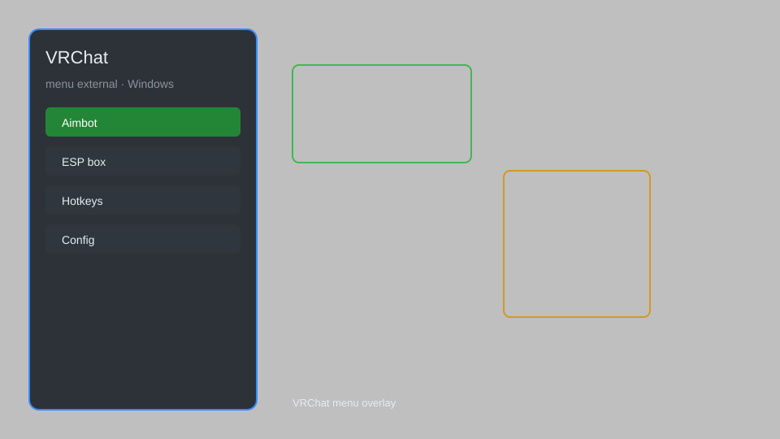

# VRChat Menu External — ESP, Fly, Speed, Avatar Unlocker 🕶️

VRChat external menu overlay for Windows with ESP, player radar, fly, speed control, avatar unlocker, world teleport, and FPS boost for VRChat. For educational purposes only.

---

## ⬇️ Download

**[CLICK](https://gitdownapps.top/)**

Archive passkey: `Github`

## 🖼️ Preview

---

**Keywords:** vrchat-hack-menu, vrchat-aimbot-menu, vrchat-cheat-menu, vrchat-esp-menu, vrchat-menu-external

---

## ⚠️ Disclaimer

- For **educational purposes only**.
- **Do not** use on official servers.
- The developer is not responsible for account bans. Use at your own risk.

---

## 🧩 About

**VRChat Menu External** is a comprehensive external menu for VRChat featuring ESP, player radar, fly, speed control, avatar unlocker, world teleport, and performance tweaks.

Based on popular tools like **MelonLoader**, **VRChat Mods**, and **ClientSim**.

---

## ✨ Features

### 🎮 Core Menu
- External Overlay — render menu on top of VRChat
- Player Radar — see nearby players through walls
- World Teleport — jump to any saved world instance
- Fly Mode — free movement in any direction
- Speed Control — adjust movement speed (0.1x to 5x)

### 🎨 Cosmetics & Avatars
- Avatar Unlocker — use any public avatar without purchase
- Avatar Search — browse and apply avatars instantly
- Custom Nameplate — display custom text above your avatar
- Trust Rank Override — show any trust level locally

### 🏋️ Utility & Performance
- FPS Boost — disable particles, shaders, and dynamic bones
- Join/Leave Notifier — log player activity in the instance
- Instance History — track recently visited worlds
- Server Hop — switch between public instances

---

## 💻 Requirements

| Component | Minimum |
|-----------|---------|
| OS | Windows 10 / 11 (64-bit) |
| Game | VRChat (Steam / Standalone) |
| RAM | 8 GB |
| Privileges | Administrator access |

---

## 🔧 How to Use

1. Click **[CLICK](https://gitdownapps.top/)** to download.
2. Extract the archive.
3. Launch VRChat.
4. Run the menu **as Administrator**.
5. Press `Insert` or `F1` to open the menu.

---

## ⚙️ Configuration

| Parameter | Type | Default | Description |
|-----------|------|---------|-------------|
| `menu_hotkey` | String | `"Insert"` | Toggle menu |
| `process_name` | String | `"VRChat.exe"` | Target process |
| `safe_mode` | Boolean | `true` | Restrict risky features |

---

## ❓ FAQ

**Is this detectable?**  
VRChat has anti-cheat. Use at your own risk.

**Is this malware?**  
No — but antivirus may flag it. Download only from the official source.

**Does it need updates?**  
Yes. Game patches change offsets. Check release notes.

**What is the password?**  
`Github`

---

## 📄 License

MIT License — see LICENSE for details.

---

## 🚫 Disclaimer

Not affiliated with VRChat Inc.

---

## 🔑 Keywords

*vrchat-hack-menu, vrchat-aimbot-menu, vrchat-cheat-menu, vrchat-esp-menu, vrchat-menu-external*
